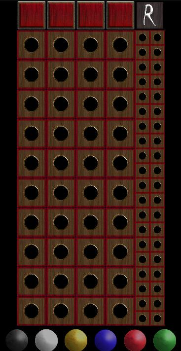
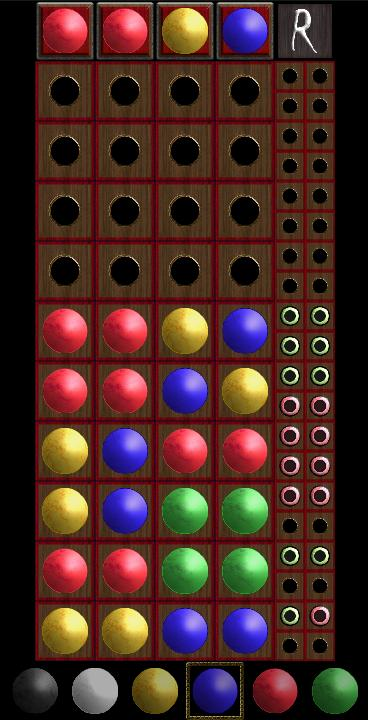

# Mastermind in <a href="https://haxe.org" > HAXE </a>

Simple adaptation du jeu Mastermind avec le moteur de jeu [Heaps.io](https://heaps.io/) utilisé et maintenu par le studio [ShiroGames](https://shirogames.com/).

[Jouer!](https://mastermind-haxe.netlify.app/)

## Compilation

il faut installer [Haxe](https://haxe.org/download/) sur votre machine.

Installer la lib Heaps.io 

`haxelib install heaps`

Le principe du langage Haxe et qu'il compile vers d'autres langages ici dans
le fichier **compile.hxml** je précise que je souhaite cibler le javascript.

`haxe compile.hxml`

On peut creer autant de fichier **hxml** qu'on souhaite de language cible.

Ouvrez index.html dans un navigateur

## Capture d'écran

 
 
